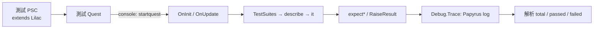

# Lilac — Tool Survey Finding

## 1. 一句話結論

**能**把 Lilac 接成我方 Papyrus 行為回歸的遊戲內 runner，但**需先**用目前 1.6.1170 工具鏈重編譯一個最小測試 Quest，證明 `startquest`、Papyrus log 摘要與乾淨存檔隔離都可靠；它不會直接替尚無 `.psc` 的 `sofia-patch` 或純文字翻譯層自動產生測試。

## 2. Lilac 測試怎麼寫、怎麼跑

核心是 `scriptname Lilac extends Quest`，使用者另寫 `extends Lilac` 的 Quest script；它確實提供 Jasmine 風格 `describe`／`it`，但 suite、case 仍是普通 Papyrus function，assert 則依型別呼叫 `expectForm`、`expectRef`、`expectInt`、`expectFloat`、`expectBool`、`expectString`（`analysis/tool-survey/repos/Lilac/Scripts/Source/Lilac.psc:4`、`analysis/tool-survey/repos/Lilac/Scripts/Source/Lilac.psc:376`、`analysis/tool-survey/repos/Lilac/Scripts/Source/Lilac.psc:398`、`analysis/tool-survey/repos/Lilac/Scripts/Source/Lilac.psc:573`）。不是 annotation/reflection，也沒有獨立於遊戲 VM 的 runner。

測試 script 掛在 Quest 上；console 執行 `startquest <EditorID>`。Quest 的 `OnInit` 在 `enabled=true` 時註冊一次 update，`OnUpdate` 呼叫 `RunTests()`；runner 依序跑 setup、`TestSuites()`、failure log、summary，最後自行 `Stop()`（`analysis/tool-survey/repos/Lilac/Scripts/Source/Lilac.psc:41`、`analysis/tool-survey/repos/Lilac/Scripts/Source/Lilac.psc:53`、`analysis/tool-survey/repos/Lilac/Scripts/Source/Lilac.psc:57`）。沒有 MCM 或需點擊的 UI 路徑。

結果只用 `Debug.Trace` 寫入 Papyrus log：逐 case 印 `SUCCESS`／`FAILED`，結尾印 `N total  N passed  N failed`，訊息固定有 `[Lilac]` 前綴（`analysis/tool-survey/repos/Lilac/Scripts/Source/Lilac.psc:425`、`analysis/tool-survey/repos/Lilac/Scripts/Source/Lilac.psc:240`、`analysis/tool-survey/repos/Lilac/Scripts/Source/Lilac.psc:975`）。

## 3. 資料流

## 4. 與我方 runtime-qa 的整合可行性

**console 注入在觸發步驟相容**：現行 runtime-qa 已把「主控台與狀態查詢」列為 AgentBridge 能力（`wf/workflows/runtime-qa/README.md:56`），而 `qa_console` 可送任何 Skyrim console command（`projects/agent-bridge/client/qa_mcp.py:88`），所以可無人值守送 `startquest MyTestQuest`，不必讓人點 MCM。

**結果判定不相容於既有 `qa_state` assertion，需加薄 adapter**：AgentBridge 的 console output 只有最後一行且不可當 assertion（`projects/agent-bridge/client/bridge.py:74`）；Lilac 又只寫 Papyrus log。可沿用 runtime-qa 要求的 fresh log window（`wf/workflows/runtime-qa/README.md:22`）與既有 `runtime_log_window.py` 的 marker 後 Papyrus 擷取（`agentctl/tools/README.md:8`），再加 parser 等待唯一 `[Lilac] ... total ... failed`，以 `failed == 0` 為 gate。現有 `agentctl/qa/` 已有 baseline、FOMOD choices、JSON reports 與 `.qa.json` specs；例如整包 spec 會啟用 AgentBridge、launch、load baseline（`agentctl/qa/specs/modpack-kr-final-runtime-smoke.qa.json:12`），但盤點未找到 Lilac/Papyrus-unit spec。

因此無人值守鏈可行，但 `qa_status` 只能證明遊戲／bridge 活著，不能替代 Lilac summary；也要在 fresh baseline 或拋棄式 save 跑，避免測試副作用污染續玩存檔。

## 5. SSE/AE 相容與授權

Lilac shallow HEAD 是 `21c8854`（2016-09-15，`Lilac 1.2 files.`）；repo 的版本史只到 v1.2，沒有 SSE／AE 更新紀錄。README 只宣稱需要 Skyrim base game，且 v1.2 移除了 SKSE dependency（`analysis/tool-survey/repos/Lilac/README.md:14`、`analysis/tool-survey/repos/Lilac/README.md:51`）。因此原始 PSC 是低依賴的移植候選，Campfire clone 也有 `_SEtest` 類別實際繼承 Lilac，但 repo 內既成 `PEX/ESP` **不能視為已驗證支援 AE 1.6.1170**；必須重編譯與實機 smoke。

授權是 MIT，copyright 2016 Chesko；允許使用、修改與散布，但須保留 copyright／permission notice（`analysis/tool-survey/repos/Lilac/MIT.LICENSE:1`、`analysis/tool-survey/repos/Lilac/MIT.LICENSE:3`）。

## 6. 使用範例與我方現況對照

Lilac repo 自己有完整 self-test：`lilac_test extends Lilac`，`TestSuites()` 宣告四組 suite，再以 `expect*` 測 matcher（`analysis/tool-survey/repos/Lilac/Scripts/Source/lilac_test.psc:1`、`analysis/tool-survey/repos/Lilac/Scripts/Source/lilac_test.psc:4`、`analysis/tool-survey/repos/Lilac/Scripts/Source/lilac_test.psc:81`）。

Campfire/Frostfall **有實際使用**，不是只有文件：`_Frost_ClothingSystem_SEtest` 繼承 Lilac、取得真實 system、宣告 suites/cases，並用 Papyrus state 做 mock seam（`analysis/tool-survey/repos/Campfire/Scripts/Source/_Frost_ClothingSystem_SEtest.psc:1`、`analysis/tool-survey/repos/Campfire/Scripts/Source/_Frost_ClothingSystem_SEtest.psc:29`、`analysis/tool-survey/repos/Campfire/Scripts/Source/_Frost_ArmorProtectionDatastoreHandler.psc:1591`）。另有 SE end-to-end suite 會啟動 Frostfall、脫裝並警告具破壞性（`analysis/tool-survey/repos/Campfire/Scripts/Source/_Frost_SETest_e2e_ClothingScript.psc:80`），證明這是遊戲內 integration test，不是純 VM unit test。

Python 遞迴盤點目前 `projects/sofia-patch/` 的 `.psc` 為 **0**；已有自動化痕跡是 Python contract/preflight tests（`projects/sofia-patch/README.md:45`、`projects/sofia-patch/tests/test_contracts.py:21`），並非 Papyrus runtime tests。因此 Lilac 現在不能直接覆蓋 Sofia script 回歸；翻譯層若只改字串仍應走靜態文字 gate，只有真的改 Papyrus 行為且保有 PSC／fixture 時才適合加 Lilac case。

## 7. 可借的概念／可行的下一步；沒查到／需驗證

Planning 候選是做一個小型 spike：以目前 Papyrus compiler 重編 `Lilac.psc`，建立停用預設的測試 Quest 與一 pass／一刻意 fail case；用 baseline → `qa_status` → `qa_console startquest` → fresh Papyrus window parser → teardown 串成一份 `.qa.json`。先挑純函式或可用 state 隔離的自有 controller，借 Frostfall 的 mock state／call-count 作法，不先碰會改玩家裝備或 quest stage 的 end-to-end case。

仍需實機確認：PSC 在 AE 1.6.1170 的編譯／執行、同一 save 重跑 Quest 時 `OnInit` 是否穩定再觸發、Papyrus logging 是否在現役 profile 開啟、summary parser 的 timeout／重複輸出規則，以及測試 plugin 的 Form/property fixture 如何可重建。未找到 Lilac 官方 SSE/AE release 或現成 CI/headless runner。
