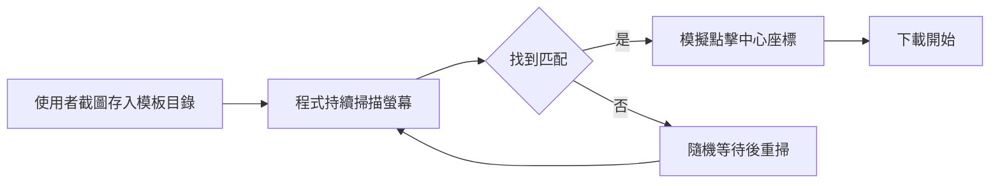

# nexus-autodl — Tool Survey Finding

**Source**: https://github.com/parsiad/nexus-autodl  
**Surveyed**: 2026-09-02（本機 shallow clone）｜**License**: MIT

## 1. 一句話結論

可借概念：以可調模板與隨機掃描簡化隨手慢速點擊，但缺 file_id、檔名、進度與 MD5 驗證，不能直接接 LoreRim 465 件批次隊列。

## 2. 它做什麼、怎麼做

README 把它稱為 autoclicker：只要 mod 或 collection 下載頁出現在螢幕，就嘗試按下載鈕
（`analysis/tool-survey/repos/nexus-autodl/README.md:7`、`analysis/tool-survey/repos/nexus-autodl/README.md:10`）。
使用者自行截取按鈕圖，可在目錄放多張模板（`analysis/tool-survey/repos/nexus-autodl/README.md:18`、
`analysis/tool-survey/repos/nexus-autodl/README.md:21`）。

核心 `NexusAutoDL._match_impl()` 先呼叫 `pyautogui.screenshot()`，逐張以
`pyautogui.locate()` 比對，取第一個命中框中心後 `pyautogui.click()`；沒有 Selenium、CDP 或瀏覽器
API（`analysis/tool-survey/repos/nexus-autodl/nexus_autodl.py:102`、
`analysis/tool-survey/repos/nexus-autodl/nexus_autodl.py:117`、
`analysis/tool-survey/repos/nexus-autodl/nexus_autodl.py:124`、
`analysis/tool-survey/repos/nexus-autodl/nexus_autodl.py:132`）。預設 grayscale、confidence 0.7；只有
OpenCV 可匯入時才傳 confidence，否則忽略（`analysis/tool-survey/repos/nexus-autodl/nexus_autodl.py:50`、
`analysis/tool-survey/repos/nexus-autodl/nexus_autodl.py:110`、
`analysis/tool-survey/repos/nexus-autodl/nexus_autodl.py:187`）。每輪隨機等 1–5 秒後再排程掃描
（`analysis/tool-survey/repos/nexus-autodl/nexus_autodl.py:52`、
`analysis/tool-survey/repos/nexus-autodl/nexus_autodl.py:137`）。

程式沒有多螢幕、視窗或瀏覽器分頁枚舉，只比對一次 PyAutoGUI 回傳的螢幕影像；可見視窗會共同競逐
模板。0.7 的近似比對、相似按鈕、縮放／主題／DPI、遮擋或捲動都可能造成漏按或誤按；命中後只記
座標，沒有核對按到哪個檔案。

## 3. 資料流

## 4. 建置與 runtime

依賴列出 `pyautogui`、Pillow、`opencv-python` 與 `click`；實際入口另用標準庫 Tkinter，OpenCV
缺席仍可跑但不套 confidence（`analysis/tool-survey/repos/nexus-autodl/requirements.txt:1`、
`analysis/tool-survey/repos/nexus-autodl/requirements.txt:3`、
`analysis/tool-survey/repos/nexus-autodl/requirements.txt:4`）。README 只提供 Windows binary，其他平台
需跑原始碼（`analysis/tool-survey/repos/nexus-autodl/README.md:16`、
`analysis/tool-survey/repos/nexus-autodl/README.md:23`）。它需要 Tk 視窗、真實螢幕影像與滑鼠座標；原始碼
沒有 headless 模式。授權是 MIT（`analysis/tool-survey/repos/nexus-autodl/LICENSE:1`）；若借碼，需保留
copyright 與 permission notice（`analysis/tool-survey/repos/nexus-autodl/LICENSE:12`）。本次依限制未 build。

## 5. 與我方接點的關係

### 問題 3：ToS（repo 自述）

repo 的 Caution 明稱用 bot 從 Nexus 下載違反其 TOS，並引錄條款稱未獲明示許可時以 software
automation 大幅超過預期平均下載量會被禁止、帳號可能停權；作者最後寫「Use this at your own risk」
（`analysis/tool-survey/repos/nexus-autodl/README.md:25`、
`analysis/tool-survey/repos/nexus-autodl/README.md:27`、
`analysis/tool-survey/repos/nexus-autodl/README.md:30`、
`analysis/tool-survey/repos/nexus-autodl/README.md:32`）。

### 問題 4：既有兩條下載路

Chrome 擴充路直接沿用已登入瀏覽器，不複製 profile、不取桌面鎖，且可由含 `file_id` 的 URL 直達；
缺點是批次內 `left_click` 不會觸發下載，需獨立點擊
（`wf/workflows/nexus-intake/download-routes.md:9`）。CDP 路可結合 DOM、指定 `file_id` 與落地核實，較適合
可觀測批次；缺點是只能 headful、需暫存登入 profile，且 DOM 改版會破壞 selector
（`wf/workflows/nexus-intake/download-routes.md:10`、`wf/workflows/nexus-intake/download-routes.md:12`）。
nexus-autodl 不在意 shadow/light DOM，只要像素仍像模板；代價是視覺改版更脆弱，也看不到進度、檔名或
下載完成。三路目前都不是原生 headless；本工具尤其直接依賴螢幕座標。

### 問題 5：CDP 已知坑對照

| CDP 坑 | 截圖比對式 |
|---|---|
| shadow-DOM／light-DOM | 不讀 DOM，對結構改變免疫；按鈕外觀一變即漏按（`agentctl/handoffs/done/2026-08-27/cx-dl2/tools/KNOWN-ISSUES.md:13`） |
| `expected_bytes=null` | 不等 bytes，因而不會假 timeout；但也完全不知是否完成（同檔`:25`） |
| 大檔二次對話框 | 可另存 Standard 模板；多一層相似按鈕也增加誤觸面（同檔`:34`） |
| 隱藏舊 modal | 隱藏元素沒像素，對此免疫；若同時可見多顆相似按鈕仍無 file_id 防線（同檔`:43`） |

### 問題 6：LoreRim 465 件隊列

runbook 要逐列解析 `file_id`、version、bytes，≤2K 才收，下載後還要入庫
（`modpack-design/content-plan/lorerim/download-runbook.md:11`、
`modpack-design/content-plan/lorerim/download-runbook.md:13`、
`modpack-design/content-plan/lorerim/download-runbook.md:21`）；隊列共 465 件
（`modpack-design/content-plan/lorerim/download-runbook.md:46`）。nexus-autodl 只有「頁面開著就找圖點」訊號，
沒有 row/file_id 選擇、版本／MD5 核對、完成等待或 fail-closed 狀態，不能直接對接；只適合人工已開對頁、
旁邊等慢速按鈕出現的隨手場景。

## 6. 可借的概念／可行下一步

planning 候選只有兩項：把「多模板＋可調 confidence＋隨機輪詢」當既有 headful 工具的 UI fallback；
或只拿模板偵測做提示，保留 CDP 的 file_id、下載事件與 MD5 gate。MIT 允許在保留 notice 的條件下修改與
散布程式碼；授權處理與 README 所述 ToS 風險提示是兩個不同層次。

## 7. 沒查到／需驗證

- repo 未明說只服務免費帳號，也未描述 Premium 用途；我方 slow-download 文件只把手動路徑定位為
  非 Premium（`wf/workflows/nexus-intake/download-routes.md:5`）。
- 未實測多螢幕、DPI、不同主題／縮放的命中率與誤觸率，也未確認各平台 PyAutoGUI 截圖邊界。
- 未驗證多模板遇到相似按鈕時的選擇結果；程式按排序載入並在首個命中後停止
  （`analysis/tool-survey/repos/nexus-autodl/nexus_autodl.py:173`、
  `analysis/tool-survey/repos/nexus-autodl/nexus_autodl.py:135`）。
