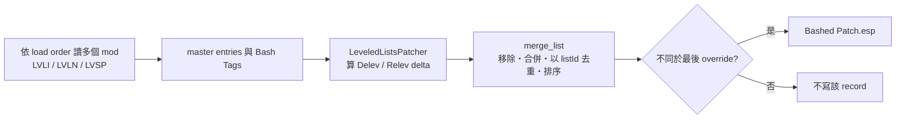

# Wrye Bash — Tool Survey Finding

**Source**: `wrye-bash/wrye-bash`（本地 shallow clone `dev`，revision `e192d181aaf2f889fb2e4ae55cacb62d3ce0ba7a`）  
**Surveyed**: 2026-09-02｜**License**: GNU GPL v3（原始碼 header 為 v3 or later）

## 1. 一句話結論

可借概念：LeveledListsPatcher 的 master-delta＋Delev/Relev 合併可補我方缺口，但現成 Bashed Patch 沒有無頭 CLI/API，且 GPL-3.0 不宜直接嵌入。

## 2. Bashed Patch 是什麼、怎麼運作

Bashed Patch 是依目前 load order 產生的新 plugin：`PatchFile` 先快取位於 patch 前的 plugins、active 狀態與 Bash Tags，再依啟用的 patcher 建 factory、逐 mod 掃描、按 `patcher_order` 執行 `buildPatch()`，最後裁掉未改 records、設定 masters 並安全寫出 `Bashed Patch.esp`（`analysis/tool-survey/repos/wrye-bash/Mopy/bash/patcher/patch_files.py:41`、`analysis/tool-survey/repos/wrye-bash/Mopy/bash/patcher/patch_files.py:65`、`analysis/tool-survey/repos/wrye-bash/Mopy/bash/patcher/patch_files.py:337`、`analysis/tool-survey/repos/wrye-bash/Mopy/bash/basher/patcher_dialog.py:188`、`analysis/tool-survey/repos/wrye-bash/Mopy/bash/basher/patcher_dialog.py:314`）。

Leveled list 的核心 class 是 **`LeveledListsPatcher`，位於 `analysis/tool-survey/repos/wrye-bash/Mopy/bash/patcher/patchers/mergers.py:785`**，共用 `AListsMerger.scanModFile()`。Skyrim 實際啟用的是 LVLI／LVLN／LVSP，不是 LVLC（`analysis/tool-survey/repos/wrye-bash/Mopy/bash/game/skyrim/__init__.py:748`）。演算法有 master delta：先保存相關 masters 每張 list 的 `listId` 集合；`Delev` 將「masters 有、目前 override 沒有」算成刪除集，`Relev` 將目前項目標成重分級集，再依 load order 合進 stored list（`analysis/tool-survey/repos/wrye-bash/Mopy/bash/patcher/patchers/mergers.py:651`、`analysis/tool-survey/repos/wrye-bash/Mopy/bash/patcher/patchers/mergers.py:683`）。`AMreLeveledList.merge_list()` 先移除 Delev/Relev 命中的舊 entry，再以 `listId` 避免跨來源重加、按完整 entry 欄位排序；同一來源本就存在的合法重複 entry 不保證被消掉。只有合併結果不同於最後 override 才標記並寫入 patch（`analysis/tool-survey/repos/wrye-bash/Mopy/bash/brec/common_records.py:442`、`analysis/tool-survey/repos/wrye-bash/Mopy/bash/brec/common_records.py:457`、`analysis/tool-survey/repos/wrye-bash/Mopy/bash/brec/common_records.py:463`、`analysis/tool-survey/repos/wrye-bash/Mopy/bash/brec/common_records.py:483`、`analysis/tool-survey/repos/wrye-bash/Mopy/bash/brec/common_records.py:489`）。

## 3. 資料流

## 4. 架構分層

#### `brec`

TES binary/record 定義層：`MelBase` 把 subrecord bytes 映射成 record attributes 並能反向 dump，`MelRecord.loadData()` 依 signature 派 loader；Skyrim 的 `MreLvli`／`MreLvln` 再宣告實際欄位（`analysis/tool-survey/repos/wrye-bash/Mopy/bash/brec/basic_elements.py:153`、`analysis/tool-survey/repos/wrye-bash/Mopy/bash/brec/record_structs.py:510`、`analysis/tool-survey/repos/wrye-bash/Mopy/bash/game/skyrim/records.py:1871`）。

#### `bosh`

檔案與 metadata/data-store 層，不是 record schema：module 自述管理 DataStore／`AFile`，`ModInfo` 代表單一 plugin，`ModInfos` 代表 Data 目錄與 load-order cache（`analysis/tool-survey/repos/wrye-bash/Mopy/bash/bosh/__init__.py:23`、`analysis/tool-survey/repos/wrye-bash/Mopy/bash/bosh/__init__.py:477`、`analysis/tool-survey/repos/wrye-bash/Mopy/bash/bosh/__init__.py:2231`）。

#### `patcher`

規則／編排層：`PatchFile` 包裝執行中的 Bashed Patch，各 patcher 掃描後依序修改其 records（`analysis/tool-survey/repos/wrye-bash/Mopy/bash/patcher/patch_files.py:41`、`analysis/tool-survey/repos/wrye-bash/Mopy/bash/patcher/patch_files.py:345`）。

## 5. 與我方接點的關係

**互補性。** `brec` 與我方 ESP I/O 是同類替代，不值得混用：ModForge 的 `PluginIo` 明定 byte layer 由 Mutagen 負責，且已能 authored LVLI/LVLN 與 entries（`projects/ModForge/src/ModForge.Core/Formats/PluginIo.cs:3`、`projects/ModForge/src/ModForge.Core/Build/Generator.Build.Lists.cs:11`、`projects/ModForge/src/ModForge.Core/Build/Generator.Build.Lists.Wire.cs:7`）；houseCARL 同樣以 Mutagen 0.53.1 讀寫，已有 winner/conflict index 與 multi-master patch writer（`projects/houseCARL/src/housecarl-core/housecarl-core.csproj:28`、`projects/houseCARL/src/housecarl-core/LoadOrderResolver.cs:463`、`projects/houseCARL/src/housecarl-core/WriteEngine.cs:1427`）。Wrye Bash 的增量價值是我方尚無的自動 Delev/Relev merge policy，不是第三套 serializer。

**Python 3／SSE-AE。** `pyproject.toml` 沒有 package/interpreter constraint，`requirements.txt` 只列依賴；runtime gate 實際要求 Python 3.11 ≤ version < 4，README 也指定 3.11 64-bit（`analysis/tool-survey/repos/wrye-bash/Mopy/bash/bash.py:944`、`analysis/tool-survey/repos/wrye-bash/Readme.md:60`、`analysis/tool-survey/repos/wrye-bash/requirements.txt:1`）。SSE 以 `SkyrimSE.exe` 偵測並接受現行 plugin header versions，version history 記有 Anniversary Edition Support；但 repo 全文沒有 `1.6.1170`，README 只明列 1.6.1130，因此 **1.6.1170 不能判成已明示驗證**（`analysis/tool-survey/repos/wrye-bash/Mopy/bash/game/skyrimse/__init__.py:58`、`analysis/tool-survey/repos/wrye-bash/Mopy/bash/game/skyrimse/__init__.py:105`、`analysis/tool-survey/repos/wrye-bash/Mopy/Docs/Wrye Bash Version History.html:100`、`analysis/tool-survey/repos/wrye-bash/Readme.md:33`）。

**無頭跑法。** 有 argparse，但選項只有路徑、backup/restore、語言等，沒有 build-patch command（`analysis/tool-survey/repos/wrye-bash/Mopy/bash/barg.py:37`、`analysis/tool-survey/repos/wrye-bash/Mopy/bash/barg.py:72`、`analysis/tool-survey/repos/wrye-bash/Mopy/bash/barg.py:100`）。核心 Python class 可被內部呼叫，卻沒有穩定公開 API；正式流程由 wx `PatchDialog` 的 Build Patch 按鈕進 `PatchExecute()`，GUI panel 產生 patcher instances 並負責 progress、錯誤、存檔與 log（`analysis/tool-survey/repos/wrye-bash/Mopy/bash/basher/patcher_dialog.py:59`、`analysis/tool-survey/repos/wrye-bash/Mopy/bash/basher/patcher_dialog.py:83`、`analysis/tool-survey/repos/wrye-bash/Mopy/bash/basher/patcher_dialog.py:172`）。Agent 不能直接無頭用；須另做 bootstrap/config adapter 或上游先抽 API。

## 6. 可借的概念／可行的下一步與授權

Planning 候選只有兩項：一是把「相對各 source masters 算 delta，再依 load order 重播」與 Delev/Relev 語意重作成 Mutagen-based pure function；二是以含新增、刪除、同 FormKey 改 level/count、合法重複 entry 的小 corpus 做 golden tests。這不是本輪施工。

根 `LICENSE.md` 是 GNU GPL v3；各核心 source header 又宣告 Wrye Bash 為 GPL v3 or later（`analysis/tool-survey/repos/wrye-bash/LICENSE.md:1`、`analysis/tool-survey/repos/wrye-bash/Mopy/bash/patcher/patchers/mergers.py:3`）。可研究、執行與修改；若散布搬碼或衍生物須履行 GPL copyleft/source 義務。現階段只借演算法概念並獨立實作，直接嵌入前另做授權相容性審查。

## 7. 沒查到／需驗證

- 沒找到 1.6.1170 字面相容宣告；需用該 runtime 的真實 load order 建 patch，再以遊戲或 xEdit 驗 LVLI/LVLN。
- 沒找到官方 headless Bashed Patch CLI、public API contract 或不初始化 wx/bosh globals 的範例。
- 沒執行 GUI、build 或 patch generation；本 finding 只證明目前 revision 的靜態控制流與資料模型。
