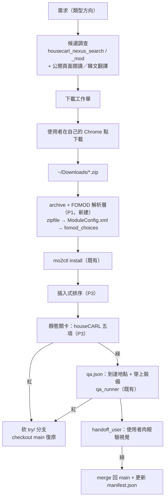

# plan：第三方 mod 取得–安裝–驗證流水線

出計畫日期 2026-08-04。上游計畫：`workflows/plans/ai-ingame-qa-loop.md`（已結案，本計畫建在它之上）。

## 目標

把「我想要某類 mod」到「這個 mod 在我的 load order 裡經過驗證」變成一條可重複、可回滾、失敗可歸因的流水線。

與上游計畫的差別：上游驗的是**自產物**（ModForge 產出，形狀已知、無 FOMOD、無依賴、有原始碼）。本計畫要吃的是**第三方 mod**（壓縮檔、FOMOD、依賴樹、SKSE 版本鎖、來源雜、無原始碼）。`mo2ctl` 與 `qa_runner` 可直接複用，斷在中間的是「壓縮檔 → 可安裝的檔案樹」這一段。

## Done when

- [x] P1：archive + FOMOD 解析層已落地（2026-08-06，9 個測試綠）；真實第三方 mod 的整條實機驗收留在 P4。
- [x] P2：MO2 profile 走 git；`try/<mod>` 可 pass 快進 main 或 fail 卸載新 mod 後回到 main。回滾判準已依實機修正為語意等價，不要求會被 MO2/引擎合法重寫的檔案 byte-identical。（2026-08-06）
- [x] P3：`static-gates` 能在不啟動遊戲、不修改 profile 的前提下直接呼叫 houseCARL stdio MCP，產出 before/after pass/fail 報告；已對 live `Default` profile 與 `_ResourcePack.esl` 實測。（2026-08-06）
- [x] P4：至少一個真實第三方 `.zip` mod 走完全程（下載工作單 → 安裝 → 排序 → 靜態關卡 → `qa.json` 驗「到達地點 + 穿上裝備」→ 視覺 handoff），並在 git 留下一個可回滾的 commit。（2026-08-07，`Bend Time Rings`，profile git `cfb34db`）

**不包含**：自動化下載（見 D5）、LOOT 整合（見 D2）、技能與劇情觸發的斷言（見 D4）、`/state` 的欄位擴充、`.7z`/`.rar` 的原生支援（見 D1）。

## 一、環境事實（2026-08-04 實查）

沿用上游計畫第一節的環境表（Proton 9.0-203、SKSE 鎖 1.6.1170、MO2 在遊戲自己的 prefix 內、Wayland、無截圖工具），以下是本計畫新查的：

| 項目 | 事實 | 來源 |
|---|---|---|
| MO2 instance | `~/games/mod-organizer-2-skyrimspecialedition/modorganizer2/`（`ModOrganizer.ini` 在此） | `find` |
| 目前 load order | 109 mod 啟用 / 1 停用（`SceneCaptureBridge Release`）、56 plugin 全 active（43 勾選 + 13 implicit） | `housecarl_load_order_status` |
| profile | 只有 `Default` 一個 | 同上 |
| **既有髒資料** | `loadorder.txt` 列了 3 個沒人提供的 CC 檔：`ccbgssse068-bloodfall.esl`、`ccbgssse069-contest.esl`、`ccvsvsse004-beafarmer.esl` | 同上（warnings） |
| houseCARL 設定狀態 | explicit-paths mode，**未指向 MO2 instance**；`papyrus_logs` / `crash_logs` 兩個路徑都 not set | 同上 |
| `mo2ctl install` 的輸入限制 | 只認「裸 `.esp/.esm/.esl`」或「已解壓資料夾」（`resolve_source()`）。**零 archive 支援、零 FOMOD 解析** | `client/mo2ctl.py:390-411` |
| Nexus 帳號 | 免費（非 Premium）→ API 的 download 端點不開放 | 使用者 |
| 常見來源格式 | Nexus 下載幾乎都是 `.zip` | 使用者 |

**前置清理（P1 之前先做）**：上面那 3 條 stale 條目要清掉。不清，靜態關卡每次都帶著同樣的雜訊輸出，久了就會被無視——而關卡一旦被無視就等於不存在。

## 二、已定案的設計決策

### D1：FOMOD 走宣告式解析，不走 GUI 精靈

`mo2ctl` 補一層 `resolve_source()` 前置：archive → 檔案樹。

- **`.zip` 用 stdlib `zipfile`**。維持 `client/` 全 stdlib 的鐵律（理由同上游 2.1：治具自己還要先裝環境就會沒人用）。`.7z`/`.rar` 不做原生支援——偵測到就找系統 `7z`/`unar`，沒有就 `handoff_user` 請使用者自己解，不為少數情況引依賴。
- **FOMOD 解析 `fomod/ModuleConfig.xml`**：把選項樹（step / group / plugin / 依賴條件）攤成可讀摘要，選擇結果寫進 install spec 的 `fomod_choices`，安裝時據此 materialize 檔案。`fomod/info.xml` 取名稱與版本填 `meta.ini`。
- **同一機制順便吃「手動多資料夾」型**（`00 Core` / `01 Optional` 那種沒有 FOMOD 但要人挑資料夾的）。

理由：GUI 點選**永遠不可重現**——同一個 mod 半年後重裝，你不會記得當初勾了什麼。宣告式的選項是可 diff、可 review、可跟著 git 分支走的，這也是本工作區既有的哲學（宣告式 spec → 產物）。代價是要實作一份 ModuleConfig schema 的子集，但那份 schema 穩定且公開。

### D2：排序做插入式，不整合 LOOT

只決定**新 mod 插哪裡**，不重排既有 109 個。依據來源：mod 頁面自述的前後關係 + `housecarl` 的 conflict tree 實際衝突 + `housecarl_check_errors`。

理由：現有 load order 是使用者實際在玩的、能跑的。對一個能跑的 load order 做全域重排是純下行風險——壞掉的成本遠大於「順序更漂亮」的收益。LOOT 整合等到插入式排序真的不夠用再說。

### D3：MO2 profile 走 git，分支即實驗（使用者 2026-08-04 提案）

`main` = 已驗證的已知良好狀態。每個候選 mod（或極小批）開 `try/<mod-name>` 分支跑完整流水線，綠燈 merge 回 `main`，紅燈砍分支 + `checkout main` 復原。

這一項同時解掉兩個問題：**失敗歸因**（一分支一 mod，壞了就知道是誰）與**回滾**（不用備份、不用記得改了什麼）。

四個實作約束：

1. **`.gitattributes` 必須設 `* -text`。** `modlist.txt` / `loadorder.txt` 是 CRLF、`plugins.txt` 是 LF（同目錄同程式寫的就是不一致，見上游 2.1）。git 預設的 eol normalize 會產生滿版假 diff，且改壞了 MO2 不報錯、症狀只表現為「裝了卻沒載入」——與上游踩過的「`sed` 對 CRLF 靜默匹配不到」是同一家族的坑。
2. **只版控 profile 文字檔，不版控 `mods/`**（GB 級）。因此需要 `manifest.json` 當 lockfile：mod 資料夾名 ↔ 來源 URL ↔ 版本 ↔ archive sha256 ↔ `fomod_choices`。沒有這份，一個 branch 只是「一串指向可能不存在的資料夾的名字」，不可重放。
3. **commit / checkout 只在 MO2 與遊戲都沒跑時做。** MO2 把 profile 存在記憶體、退出時整份寫回，執行中改檔會被靜默回滾（上游五節風險已證）。直接複用 `mo2ctl` 的 `require_writable()`。
4. **repo 落點不在本工作區。** 依 `README.md`「本機部署狀態不在本資料夾」與 `AGENTS.md` 的目錄職責，modlist 是部署狀態。就地在 MO2 instance `git init`（不做 copy-in/copy-out，避免漂移），remote 若要開就開 **private**（modlist 內容本身即敏感）。**治具程式碼**則放 `agent-bridge/client/`，與 `mo2ctl` 同層同一份合約。

### D4：測試範圍先收到「到達地點 + 穿上裝備」（使用者 2026-08-04 決定）

使用者原本提的四項驗證需求，經查 `/state` 實際欄位（`agent-bridge/src/State.cpp`）後的可斷言性：

| 需求 | 可斷言 | 依據 |
|---|---|---|
| **到達該地點** | ✅ 納入本計畫 | `coc` / `player.moveto` → 斷言 `player.cell_form_id`（**不是 `cell`**，EDID 會被漏帶 EDID 的 override 抹掉，上游 3.x 首跑抓到過）+ `position` + `interior` |
| **穿上裝備** | ✅ 納入本計畫 | `player.additem` + `equipitem` → 盔甲斷言 `inventory[*].worn`（**不在 `equipped`**）、武器/法術斷言 `player.equipped.{right,left}` |
| 觸發該劇情 | ⏸ 延後 | `quests` 只列 active、只有數字 stage 無文字；`game.dialogue` 可斷 `topic`/`speaker`/`quest`。演出本身（語音/鏡頭/動畫）屬視覺 → handoff |
| 使用該技能 | ⏸ 延後 | **`/state` 沒有已知法術 / shout / perk 清單**，只有「當下拿在手上的」。要直接驗得擴 `State.cpp` 加一個 opt-in block；目前只能斷間接副作用（`nearby_actors[*].dead`、`actor_values.*.max` 變化） |

延後的兩項等第一批實際要裝的 mod 確定、看是否真的需要再回頭——先擴欄位是在猜。

### D5：下載維持人工發動，不做瀏覽器自動化

免費帳號下 Nexus 的 download 端點是 Premium 限定，自由帳號的下載路徑**不在 API 裡**。驅動網頁的 Slow Download 按鈕違反 Nexus ToS、有封號風險，CAPTCHA 也無法代解。

改為：AI 產出**下載工作單**（mod 頁 URL、精確檔名 + 版本、依賴樹已解、安裝順序註記，Nexus 來源用 `housecarl_nexus_search` / `housecarl_nexus_mod`），使用者一次點完，檔案落 `~/Downloads`，AI 從那裡接手。**流水線從 `~/Downloads` 往後與來源無關。**

**多來源的分工**（使用者 2026-08-04 討論韓文站與俄語站後定案）：

| AI 做 | AI 不做 |
|---|---|
| 讀公開頁面、**翻譯外語**、整理需求／前置／安裝說明（語言隔閡是非英語站最大門檻，此處價值最高） | 需登入／入會審核的站（Naver cafe 等）的登入動作 |
| `~/Downloads` 之後的全流程（與來源無關） | 從匿名檔案空間（Mega／Drive 直鏈）代抓二進位檔 |
| 框架類（SKSE DLL、papyrus util）的技術資訊整理 | — |

**非 Nexus 來源的兩個實務差異**：(a) 無 API 可查版本與依賴 → `mo2ctl` 會填預設 `version=0.0.0` / `modid=0`，來源與版本必須靠 `manifest.json` 手記；(b) 社群站台的框架類常鎖 SKSE runtime 版本，本機鎖 1.6.1170 → `housecarl_skse_inventory` 的版本鎖偵測對這些來源**比對 Nexus 更關鍵**。

若日後上 Premium，API download 路徑就開了，D5 值得重新評估；目前不值得。

### D7：搜尋與抓取外包給 `agy`（使用者 2026-08-04 提議，同日實測可用）

`~/.local/bin/agy` 是另一套 agentic CLI，有 print mode (`-p`)、`--output-format json`、`--json-schema`（可強制結構化輸出）、`--model` 可選（gemini-3.6-flash / claude-sonnet-4-6 / gpt-oss-120b 等）。**候選調查與頁面抓取這類跑量的活外包給它**，主 session 只做 schema 設計與判斷取捨。

- 理由：搜尋抓取是 token 大戶但判斷含量低，用便宜模型跑量、貴模型收斂，成本結構才對。與既有慣例一致（簡單的事實查證／盤點交給便宜的 subagent）。
- 用法：`agy -p "<查詢>" --output-format json --json-schema <schema>` → 結構化候選清單。**schema 要自己出**，不然回來的是散文，還得再解析一次。
- **輸出一律當未驗證資料。** 2026-08-04 實測俄語站台調查，回報結構完整、內容看似合理，但「下載是否需登入」這類會變動的事實仍須在真正要用時現場確認。它的角色是把搜尋範圍收窄，不是提供事實裁決。

實測結果（俄語圈站台）記在下方附錄。

### D6：靜態關卡先行，遊戲啟動是最後一關

冷啟動一輪 20–30 秒，且 Proton 反覆冷啟動會累積不穩（上游五節風險）。第三方 mod 帶的問題大多不必開遊戲就能抓：

| 檢查 | 抓什麼 |
|---|---|
| `housecarl_load_order_status` | 缺 master、stale 條目、mod/plugin 啟用狀態對不上 |
| `housecarl_check_errors` | FormID 衝突、結構性錯誤 |
| `housecarl_skse_inventory` | **SKSE DLL 鎖死在別的 runtime 版本**、DLL 被兩個 mod 爭用、非 plugin DLL 混入 |
| `housecarl_validate_scripts` | 帶進來的 Papyrus 腳本能否成立 |
| `housecarl_validate_dialogue` | 對話條件／分支斷裂 |

**且一次只裝一個（或極小批）再跑一輪。** 一口氣裝十五個再測，紅燈時無法歸因——這也是 D3 分支制的前提。

houseCARL 目前是 explicit-paths mode，要先 `housecarl_set_mo2_instance` 指向 MO2 instance，並用 `housecarl_set_tool_path` 補上 `papyrus_logs` / `crash_logs` 兩個路徑（診斷時要讀）。

## 三、架構



git 分支的生命週期與上圖同步：`try/<mod>` 在 F 之前開，在 M 或 R 收束。

## 四、分階段任務

### P0 — 前置（**2026-08-04 執行完畢，除 0.2 前半受阻**）

git repo 落在 `<MO2 instance>/profiles/`（不是 instance 根目錄——那會把 `mods/` 的 GB 級內容拉進版控範圍，`.gitignore` 出錯的代價太高）。三個 commit：`a636b86` 基線 → `57a7097` 清 stale → `317508d` AgentBridge/QA。

| # | 任務 | 狀態 |
|---|---|---|
| 0.1 | 清掉 `loadorder.txt` 那 3 條 stale CC 條目 | ✅ 已清，plugin 56→53 且 53 個全部 resolve 成功，houseCARL 警告歸零 |
| 0.2 | `housecarl_set_mo2_instance` 指向 MO2 instance | ⛔ **受阻——houseCARL 的 Linux 路徑 bug**：它把 `ModOrganizer.ini` 的 `gamePath` 當字面路徑，沒把 Wine 的 `Z:\` 翻回 Linux，接上 `/Data` 就壞。已記入 `WAIT_USER.md`。**影響有限**：explicit-paths mode 全程可用，只失去 `load_order_status(profile=...)` 的跨 profile 比對 |
| 0.2b | `housecarl_set_tool_path` 補 `papyrus_logs` / `crash_logs` | ✅ 都設好。`papyrus_logs` = prefix 內 `Logs/Script`（有 `Papyrus.0-3.log`）；`crash_logs` = `SKSE/` 本身——CrashLogger 是把 `crash-<時間>.log` **平放在 SKSE 資料夾**，沒有 `Crash Logs` 子目錄。**現存 20 份，最新 2026-08-02**，G5 的 triage 一開始就有真實素材 |
| 0.3 | 開 QA profile | ✅ `profiles/QA`，與 `Default` **只差 AgentBridge 那一行**，其餘檔案 byte-identical。`LocalSaves`/`LocalSettings` 維持 false 與 Default 一致——開它們能得到真正的存檔/ini 隔離，但會讓 `qa_runner` 的 baseline 複製路徑失效，該另外刻意做而不是當副作用 |
| 0.4 | git init + 基線 commit | ✅ `.gitattributes` 設 `* -text`，實測 index 內 CRLF 原樣保留；`.mo2ctl-backups/` 與 `*.bak-*` 排除。12 檔 358 行 |
| 0.5 | AgentBridge 移出正式 profile | ✅ `Default` 停用（109→108 enabled）、`QA` 啟用 |
| 0.3 | 開 QA profile（複製 `Default`），`MO2_PROFILE` 指過去。注意 `mods/` 是 profile 共用的——隔離的是啟用狀態，不是檔案 |
| 0.4 | **git init + commit 現狀為 `main`**（原列 P2.1，2026-08-04 重審上移）。P1 要拿真實第三方 mod 測試，若那時還沒有 `main` 可回滾，第一次紅燈就沒有救援路徑——這是順序錯誤，不是排程偏好 |
| 0.5 | `AgentBridge` 改為 **QA profile 啟用、`Default` 停用**（現況見附錄 G8） |

### P1 — archive + FOMOD 解析層（**優先，整條斷在這裡**）

| # | 任務 | 驗證 |
|---|---|---|
| 1.1 | `.zip` 解壓（stdlib `zipfile`），含 zip-slip 路徑檢查；`.7z`/`.rar` 偵測外部工具或 handoff | 一個無 FOMOD 的第三方 zip 能裝進 MO2 並被引擎載入（`/state?include=plugins`） |
| 1.2 | `fomod/ModuleConfig.xml` 解析：step / group / plugin / 依賴條件 → 可讀摘要 | 對一個真實 FOMOD mod 印出的選項樹與 MO2 GUI 顯示一致 |
| 1.3 | `fomod_choices` 宣告式選項 → materialize 檔案；`fomod/info.xml` → `meta.ini` | 同一份 spec 重跑兩次產出的 mod 資料夾 byte-identical |
| 1.4 | 「手動多資料夾」型（`00 Core` 那種）共用 1.3 的機制 | 一個此型 mod 裝對 |

### P2 — modlist git 治具

| # | 任務 | 驗證 |
|---|---|---|
| 2.1 | 就地 `git init` + `.gitattributes`（`* -text`）+ `.gitignore`（排除 `mods/`、快取、log） | commit 後 `git diff` 對未改動的檔案為空（證明沒被 eol normalize） |
| 2.2 | `manifest.json` schema 與寫入（mod 名 / 來源 / 版本 / sha256 / `fomod_choices`） | 從 manifest 能重放一次安裝，結果與原次一致 |
| 2.3 | `try/` 分支開關收束的治具指令，內建 `require_writable()` 互斥 | 紅燈情境：砍分支 + checkout main → MO2 重啟後 profile 三檔與安裝前 byte-identical |

### P3 — 排序與靜態關卡

| # | 任務 | 驗證 |
|---|---|---|
| 3.1 | 插入式排序：依 mod 頁自述 + conflict tree 決定落點 | 新 mod 的 plugin index 落在預期位置，既有 109 個相對順序不變 |
| 3.2 | 靜態關卡串成一步，出 pass/fail 報告 | 對故意缺 master 的 mod 能紅燈攔下、且不必啟動遊戲 |

### P4 — 端到端

| # | 任務 | 驗證 |
|---|---|---|
| 4.1 | 挑一個真實第三方 zip mod 走完全程，產出 `qa.json`（到達地點 + 穿上裝備） | 報告全綠 + 一則視覺 handoff；`main` 上留下可回滾 commit |

## 五、風險

- **第三方 mod 會動到你正在玩的 load order。** 這是本計畫與上游最大的差別：上游測的是自產的 no-op plugin，本計畫測的是別人寫的、會改記錄的東西。緩解＝D3 分支制 + P0.3 的 QA profile + D6 的一次一個。
- **`mods/` 是 profile 共用的。** git 分支能回滾啟用狀態與順序，**回滾不了已經複製進 `mods/` 的檔案**。`try/` 分支砍掉時要一併 `mo2ctl uninstall`，否則 `mods/` 會累積殘渣。
- **就地 `git init` 在 MO2 instance 裡。** MO2 自己不知道 git 存在，退出時整份寫回 profile 是正常行為，不是衝突；但**絕不能在 MO2 執行中 checkout**（會被靜默回滾，且是最難查的那種失敗）。
- **DLL 覆寫前例。** `scene-capture-bridge` 的 `world.md` 記過一次 background agent 用 `cp` 就地覆寫正在載入中的 DLL、把使用者正在玩的遊戲弄死（無 crash log）。安裝類動作對「遊戲或 MO2 任一在跑」一律拒絕——`mo2ctl` 已有此檢查，新增的解壓層不得繞過。
- **FOMOD schema 的長尾。** ModuleConfig 的條件式依賴（`conditionalFileInstalls`、flag 傳遞）有不少實務變體。P1 只做能覆蓋常見情況的子集，遇到解析不了的就 `handoff_user` 退回人工，**不做半正確的猜測**——猜錯的 FOMOD 選項是最難從遊戲內症狀反推的一類問題。
- **非 Nexus 來源無版本資訊。** manifest 的版本欄位會有「使用者手填」或「未知」的條目，這削弱可重放性。接受，並在 manifest 明確標記來源類型，別讓「未知」看起來像「0.0.0」。
- **無法 headless**（沿用上游）：遊戲要顯示輸出，這條流水線只能在桌面 session 跑。

## 六、附錄：俄語圈站台調查（2026-08-04，`agy` 產出 + 本 session 判讀）

`agy` 回報七個站台仍活躍：`gamer-mods.ru`、`modgames.net`、`tesall.ru`／`tesall.club`、`playground.ru`、`coldharbour.ru`、`lastrium.com`、`all-mods.ru`。原始回報未逐項驗證（依 D7，當未驗證資料）。

**判讀後的取用建議**——七個裡只有兩個值得花時間：

| 站台 | 值不值得 | 理由 |
|---|---|---|
| `tesall.club` | ✅ | 有俄語圈**獨占的原創** mod 與 lore 深度內容，這是 Nexus 拿不到的東西 |
| `coldharbour.ru` | 🟡 | 精緻俄化為主，原創少；價值在少數獨占項 |
| 其餘五個 | ❌ | **主要是搬運轉載** |

搬運站不值得的三個具體理由（不是原則問題，是實務問題）：

1. **轉載版通常是舊版本**，而且你無從得知它對應上游哪一版 → 直接違反本計畫 manifest 的可重放性前提（D3.2）。
2. **俄化版會替換字串**。對非俄語 playthrough 這是主動的傷害——遊戲內會冒出俄文文本，而且和其他 mod 的字串補丁互相打。挑俄語站必須確認拿的是原版而非 localized 版。
3. **走廣告分流／網盤直鏈的二進位檔屬於不可信來源**，AI 不代抓（同 D5）。

**結論**：俄語站的正確用法是「找 Nexus 上沒有的原創作品」，不是「換個地方下載 Nexus 上就有的東西」——後者拿到的嚴格更差。

## 七、重審補漏（2026-08-04，動工前對抗式複查）

以 houseCARL 實查 + 讀 `mo2ctl.py` 原始碼複查本計畫，找到 11 項缺漏。**G1–G4 是會讓流水線出錯而非只是不完整的等級**，優先補。

### G1 — `archives.txt` 沒人管（P1 必補）

profile 裡除了三個 txt 還有 **`archives.txt`（BSA 啟用清單）**，`mo2ctl.py` 對它**完全沒有處理**（grep `archives` 只命中一句註解，`.bsa` 只出現在 `looks_like_mod_root()` 的副檔名檢查裡）。

後果：第三方 mod 帶 `.bsa` 而該 BSA 的 basename 不匹配任何啟用 plugin 時，**BSA 靜默不載入** → 資產全缺（紫貼圖／隱形／進場 CTD），而 `plugins.txt` 看起來一切正常。修法是 houseCARL 的 `housecarl_create_plugin`（其 doc 明文就是為「需要 basename 解析得到的 placeholder plugin」設計），或補 `archives.txt` 條目。

### G2 — `mo2ctl install` 落在最高優先權（P1 必補）

`mo2ctl.py:454-455` 把新 mod 插在 `modlist.txt` 第 1 行，程式碼註解自己寫著 `line 1 is top priority`。對 ModForge 的 no-op plugin 無差別；對第三方**貼圖／模型／腳本** mod，這代表**新裝的未驗證 mod 自動贏過全部 109 個既有 mod 的檔案衝突，且靜默無提示**。

P1 必須加明確的優先權落點參數，預設不再是 top。這與 D2 的「插入式排序」是同一件事的檔案層對應——D2 只講了 plugin 順序，漏掉 mod 檔案優先權，那是兩套獨立的排序。

> **2026-08-23 後續：已實作，但預設換了一種踩法。** `mo2ctl` 現在有 `--priority`
> （`bottom`／`top`／`before:<mod>`／`after:<mod>`），預設 `bottom`，G2 要求的「不再靜默贏過既有 mod」
> 已達成。**但對覆蓋層而言 `bottom` 是完全相反的錯**——翻譯層的存在意義就是要贏過本體，
> 裝在下面等於整層失效，而且**沒有任何錯誤徵兆**：檔案在磁碟上、mod 也啟用著，英文原版照樣贏。
>
> 實際踩到四個層（11 個檔）：Timing is Everything、The Choice is Yours、At Your Own Pace、SkyParkour。
> 另有一個是把 `after:<本體>` 誤解成「疊在上面」——`after` = 檔案裡排在後面 = **更低**優先權。
>
> 所以裝覆蓋層一律要明確傳 `--priority "before:<本體 mod 名>"`，並用
> [`mod-library/l10n/tools/audit_layer_priority.py`](../../../mod-library/l10n/tools/audit_layer_priority.py)
> 逐檔案路徑驗證勝出者。這條與 G7 的 SKSE 副本檢查是同一類問題：**檔案層的勝負無聲無息，
> 必須主動稽核，不能靠沒報錯就當作對的。**

### G3 — 資產層完全沒檢查（D6 補強）

D6 的靜態關卡只查 record／script／dialogue。但實務上第三方 mod 失效最大宗是**資產層**：缺貼圖→紫、缺模型→隱形或 CTD。現成但未使用的工具：

- `housecarl_asset_status` — 走 MO2 VFS 解析指定 Data 相對路徑：誰提供、loose 還是 BSA、有無多方爭用、是否根本不存在。正是「為什麼我的 override 沒生效」「這貼圖從哪來」的答案。
- `housecarl_bsa_list` — 列 BSA 內容（需 BSArch 路徑，xEdit 附帶）。
- `housecarl_nif_inspect` — 模型層檢查。

### G4 — contested DLL 要做 before/after diff（D6 補強）

實查現況：**5 個 version-LOCKED SKSE DLL 全鎖 1.6.1170**（`PapyrusUtil` / `JContainers64` / `skee64` / `Fuz Ro D'oh` / `SSEFpsStabilizer`），且**已存在 2 個爭用**（`BehaviorDataInjector.dll`、`BFCO.dll`）。

第三方 mod **極常自帶** PapyrusUtil／JContainers 的副本。若它在 VFS 贏了（而 G2 的 top-priority 預設會讓它贏），這 109 個 mod 會一起壞，而症狀是散彈式的腳本失效，極難反推。所以 `housecarl_skse_inventory` 的 contested 清單必須**安裝前後各跑一次做 diff**，不是只看一次。

### G5 — 沒有 crash 三角測量步驟（D6 補強）

**`CrashLogger` v1.22.0 已裝已啟用**（`modlist.txt:84`）。P0.2b 已把 `crash_logs` 指到正確位置——注意它是把 `crash-<時間>.log` **平放在 `SKSE/` 資料夾**，沒有 Windows 慣例的 `Crash Logs` 子目錄。

#### 2026-08-04 實查 20 份既有 log 的結論（triage step 要照這些前提設計）

**1. Proton 下約 40% 的 log 沒有 call stack。** 20 份裡 8 份**完全沒有 `CALL STACK` 段落**（例：`crash-2026-07-05-19-07-04.log`，44 秒 uptime、有完整例外分析與 relevant objects，但到 `SYSTEM SPECS` 就結束）。堆疊回溯要靠 `RtlVirtualUnwind`／`StackWalk64`，Wine 的實作不完整。**所以「crash log 會指名肇事者」只有約六成成立**，triage step 不能把它當保證，拿不到堆疊時要能明說「這次無法歸因」而不是沉默。

**2. 一秒內的第二份 log 是 crash handler 自己崩掉的產物，不是第二次崩潰。** `18:44:30`+`18:44:31`、`18:48:48`+`18:48:49` 兩組相隔一秒，後者都是 700–1,000 bytes 的殘缺檔。**triage 要按時間鄰近去重**，否則會把一次事故數成兩次。

**3. `PROCESS MEMORY: Private: 117440444.07 MB`（117 TB）在每份 log 裡都出現**，是 Wine 回報的垃圾值。別去追。

**4. 這個 load order 沒有慣性肇事的第三方 plugin。** 堆疊頂端幾乎全是 `SkyrimSE.exe`（引擎）與 `d3d11.dll` / `VCRUNTIME140.dll`。`EngineFixes.dll` 出現在 3 份裡，但它本來就 hook 一大堆東西，出現不等於肇事。唯一一次第三方 plugin 出現在前三個 frame 的是 `MCM-Unlocked.dll`（1 份）。

**5. 重複出現的同一位址是最有價值的訊號。** 兩組成對：`SkyrimSE.exe+02C3957 lock inc [rax+0x170]`（6/13 兩次，26s 與 46s）與 `SkyrimSE.exe+0146110 mov rax, [rcx+0xC8]`（6/13 兩次，4 分與 24 分）。同址重現代表是可重製的問題，值得單獨追；散落的單次崩潰不值得。

**6. 唯一被證實的 plugin 衝突就是 agent-bridge 自己那次。** `crash-2026-08-02-08-41-23.log`：uptime **6,599ms**（agent-bridge README 記「~6.6s，Papyrus VM init」，分毫不差）、`Tried to execute memory at 0x000158B3D6AE`（不可讀）、`POSSIBLE RELEVANT OBJECTS` 滿是 `SkyrimScript::*` / `BSScript::Internal::VirtualMachine` / `VMInitThread`，call stack 是：

```
[0][P] 0x000158B3D6AE                            ← 跳進不可讀記憶體
[1][S] AgentBridge.dll+0054404
[2][S] ConsoleUtilSSE.dll+00B9F94  spdlog::logger::sink_it_
```

**這份 log 給了 README 那條通則的直接證據**——README 是從症狀推論「兩個 plugin patch 同一段序言」，log 直接指出碰撞對象是 ConsoleUtilSSE 的 spdlog sink。該 detour 已依決策放棄，且 AgentBridge 已於 P0.5 移出正式 profile，此案已結。

**triage step 的設計結論**：讀 `crash_logs` → 按時間鄰近去重 → 有堆疊的取前三個有模組名的 frame 交叉比對本次新裝的 mod → 沒堆疊的只回報例外位址、指令、`POSSIBLE RELEVANT OBJECTS` 與 uptime，並明確標為「無法歸因」。uptime 本身就是強訊號：**6 秒內＝載入期（plugin 衝突）、數十秒＝進場、數分鐘以上＝遊玩中（內容或記憶體問題）**。

### G6 — 要版控的不是三個檔，是整個 profile 資料夾（D3 修正）

實查 profile 內容：`modlist.txt`、`plugins.txt`、`loadorder.txt`、**`archives.txt`**、`lockedorder.txt`、`initweaks.ini`、`settings.ini`、`skyrim.ini`、`skyrimcustom.ini`、`skyrimprefs.ini`。

D3 原文寫「profile 三檔」是錯的。ini 類也必須版控——有些 mod 要求 ini 修改，那些改動同樣需要能回滾。另外 `.mo2ctl-backups/` 要進 `.gitignore`；`modlist.txt.bak-before-agentbridge`（上游 0.3 留下的）是殘骸，可清。

### G7 — 下載工作單缺「對照已裝」這一步（D5 修正）

109 個 mod 已涵蓋大多數常見前置（SkyUI、MCM Helper、po3 全套、PapyrusUtil、JContainers、RaceMenu、XPMSE、FNIS…）。工作單若不 diff 已裝清單，會叫使用者重下已經有的東西——而**重裝框架就是 G4 的觸發路徑**。

工作單必須對每個依賴標記三態：已裝且版本足夠（跳過）／已裝但版本不足（升級，且標明風險）／未裝（下載）。查法用 `housecarl_load_order_status(lookup=...)` + `housecarl_skse_inventory(filter=...)`。

### G8 — AgentBridge 現在就在玩家 load order 裡

`modlist.txt:3` 是 `+AgentBridge`，`skse_inventory` 確認 `AgentBridge.dll` v0.3.0 已啟用。也就是**每次正常玩遊戲都開著 5099 這個會執行任意 console 指令的 port**。這與它自己的設計意圖相反（上游 1.1：「測試治具，每次 QA 跑完就卸，絕不能進玩家 load order」）。已補為 P0.5。

（`SceneCaptureBridge` 同樣在啟用中，但那是作者工具、使用者自己在用，不同性質，不動。）

### G9 — SkyLinkAI 已經是第二套遊戲內 MCP

`skse_inventory` 查到 `SkyrimMCPPlugin.dll` + `SkyLinkAI_Server\{SkyrimMCP,ModelContextProtocol,ModelContextProtocol.Core}.dll`（mod 名 `SkyLinkAI`）。

兩個待確認：(a) 在為 D4 延後的「技能／法術清單」動手改 `State.cpp` 之前，**先看 SkyLinkAI 是否已經暴露那些欄位**，可能省掉整個 C++ 改動；(b) 兩套 in-game server 是否搶 port 或 hook——AgentBridge 固定 5099，SkyLinkAI 用什麼未查。

### G10 — 沒有衝突解決 patch 這一步

實查確認 load order 裡**沒有** bashed／smashed／merged patch（所以「加 mod 要重生 bashed patch」這條不適用，是好消息）。

但反面是：目前純靠排序決定衝突勝負，兩個 mod 都要改同一筆記錄時只能二選一。houseCARL 有 `housecarl_forward_record` / `housecarl_bulk_apply` / `housecarl_cross_plugin_query` 正是做這個的，而本計畫沒有「必要時產 patch plugin」這一步。暫不列入 Done when（會讓範圍膨脹），但要記著這是排序解不了的那一類問題的出口。

### G11 — baseline 只有一份 level-1 空手存檔

上游 D2 記「baseline 組合不預先擴充」是使用者決定，成立。但第三方 mod 會比 no-op plugin 更快撞到這面牆：level 1、無 perk、無裝備 → 等級門檻、perk 門檻、前置任務都測不到。**預期 P4 就會需要第二份 baseline**，屆時再開，但別當意外。

### 對 D5 的簡化（2026-08-04）

多來源分工收斂為單一原則：**AI 讀公開頁面與翻譯，不代抓需登入的站或匿名檔案空間的二進位檔**。

## 八、狀態

P0–P4 已完成。實作在 `projects/agent-bridge/`：P1 `30a97be`、P2 `35d5692`、P3 `6106646`；2026-08-07 P4 實測後補上 `validate_scripts` scoped false-positive 修正與 `examples/bend-time-rings.qa.json`，並重跑 py_compile 與 21 個單元測試全綠。設計與 live smoke 證據分別在該 repo 的 `client/P1-ARCHIVE-FOMOD-REPORT.md`、`P2-PROFILE-GIT-REPORT.md`、`P3-STATIC-GATES-REPORT.md`。

P4 實測 mod 為 `Bend Time Rings`（Nexus 10974；本機 archive `Stop and Slow Time with a Ring -v1.0.0--10974-1-0-0.zip`，sha256 `53f6d341cc72c143bd45d4518a487934345ab0b7da725b5d8cb880b1bcdc5513`）。流程結果：`QA` profile 上 `try/bend-time-rings` 安裝到 bottom priority，manifest 記錄 archive catalog `present`；houseCARL scoped static gates 對 `BendTimeRings.esp` 無新增 SKSE/script 問題；`qa_runner.py examples/bend-time-rings.qa.json` 驗到 `BendTimeRings.esp` 載入、到達 `WhiterunBanneredMare`（`cell_form_id=90206`）、`Ring of Slow Time` 在 inventory 且 `worn=true`；使用者視覺確認正常渲染且有 ring。profile git 已 fast-forward 到 `cfb34db Validate Bend Time Rings P4`。
