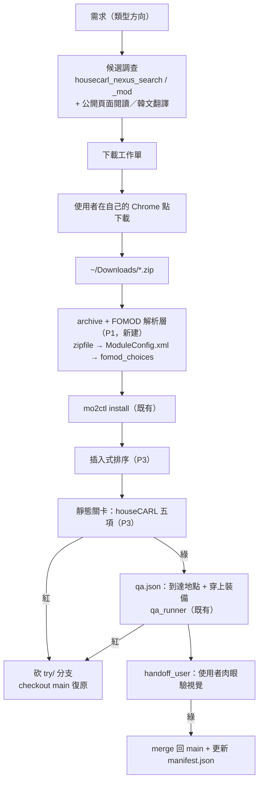

# plan：第三方 mod 取得–安裝–驗證流水線

出計畫日期 2026-08-04。上游計畫：`wf/workflows/plans/ai-ingame-qa-loop/README.md`（已結案，本計畫建在它之上）。

## 目標

把「我想要某類 mod」到「這個 mod 在我的 load order 裡經過驗證」變成一條可重複、可回滾、失敗可歸因的流水線。

與上游計畫的差別：上游驗的是**自產物**（ModForge 產出，形狀已知、無 FOMOD、無依賴、有原始碼）。本計畫要吃的是**第三方 mod**（壓縮檔、FOMOD、依賴樹、SKSE 版本鎖、來源雜、無原始碼）。`mo2ctl` 與 `qa_runner` 可直接複用，斷在中間的是「壓縮檔 → 可安裝的檔案樹」這一段。

## Done when

- [x] P1：archive + FOMOD 解析層已落地（2026-08-06，9 個測試綠）；真實第三方 mod 的整條實機驗收留在 P4。
- [x] P2：MO2 profile 走 git；`try/<mod>` 可 pass 快進 main 或 fail 卸載新 mod 後回到 main。回滾判準已依實機修正為語意等價，不要求會被 MO2/引擎合法重寫的檔案 byte-identical。（2026-08-06）
- [x] P3：`static-gates` 能在不啟動遊戲、不修改 profile 的前提下直接呼叫 houseCARL stdio MCP，產出 before/after pass/fail 報告；已對 live `Default` profile 與 `_ResourcePack.esl` 實測。（2026-08-06）
- [x] P4：至少一個真實第三方 `.zip` mod 走完全程（下載工作單 → 安裝 → 排序 → 靜態關卡 → `qa.json` 驗「到達地點 + 穿上裝備」→ 視覺 handoff），並在 git 留下一個可回滾的 commit。（2026-08-07，`Bend Time Rings`，profile git `cfb34db`）

**不包含**：自動化下載（見 D5）、LOOT 整合（見 D2）、技能與劇情觸發的斷言（見 D4）、`/state` 的欄位擴充、`.7z`/`.rar` 的原生支援（見 D1）。

## 一、環境事實（2026-08-04 實查）

沿用上游計畫第一節的環境表（Proton 9.0-203、SKSE 鎖 1.6.1170、MO2 在遊戲自己的 prefix 內、Wayland、無截圖工具），以下是本計畫新查的：

| 項目 | 事實 | 來源 |
|---|---|---|
| MO2 instance | `~/games/mod-organizer-2-skyrimspecialedition/modorganizer2/`（`ModOrganizer.ini` 在此） | `find` |
| 目前 load order | 109 mod 啟用 / 1 停用（`SceneCaptureBridge Release`）、56 plugin 全 active（43 勾選 + 13 implicit） | `housecarl_load_order_status` |
| profile | 只有 `Default` 一個 | 同上 |
| **既有髒資料** | `loadorder.txt` 列了 3 個沒人提供的 CC 檔：`ccbgssse068-bloodfall.esl`、`ccbgssse069-contest.esl`、`ccvsvsse004-beafarmer.esl` | 同上（warnings） |
| houseCARL 設定狀態 | explicit-paths mode，**未指向 MO2 instance**；`papyrus_logs` / `crash_logs` 兩個路徑都 not set | 同上 |
| `mo2ctl install` 的輸入限制 | 只認「裸 `.esp/.esm/.esl`」或「已解壓資料夾」（`resolve_source()`）。**零 archive 支援、零 FOMOD 解析** | `client/mo2ctl.py:390-411` |
| Nexus 帳號 | 免費（非 Premium）→ API 的 download 端點不開放 | 使用者 |
| 常見來源格式 | Nexus 下載幾乎都是 `.zip` | 使用者 |

**前置清理（P1 之前先做）**：上面那 3 條 stale 條目要清掉。不清，靜態關卡每次都帶著同樣的雜訊輸出，久了就會被無視——而關卡一旦被無視就等於不存在。

## 三、架構

git 分支的生命週期與上圖同步：`try/<mod>` 在 F 之前開，在 M 或 R 收束。

## 五、風險

- **第三方 mod 會動到你正在玩的 load order。** 這是本計畫與上游最大的差別：上游測的是自產的 no-op plugin，本計畫測的是別人寫的、會改記錄的東西。緩解＝D3 分支制 + P0.3 的 QA profile + D6 的一次一個。
- **`mods/` 是 profile 共用的。** git 分支能回滾啟用狀態與順序，**回滾不了已經複製進 `mods/` 的檔案**。`try/` 分支砍掉時要一併 `mo2ctl uninstall`，否則 `mods/` 會累積殘渣。
- **就地 `git init` 在 MO2 instance 裡。** MO2 自己不知道 git 存在，退出時整份寫回 profile 是正常行為，不是衝突；但**絕不能在 MO2 執行中 checkout**（會被靜默回滾，且是最難查的那種失敗）。
- **DLL 覆寫前例。** `scene-capture-bridge` 的 `world.md` 記過一次 background agent 用 `cp` 就地覆寫正在載入中的 DLL、把使用者正在玩的遊戲弄死（無 crash log）。安裝類動作對「遊戲或 MO2 任一在跑」一律拒絕——`mo2ctl` 已有此檢查，新增的解壓層不得繞過。
- **FOMOD schema 的長尾。** ModuleConfig 的條件式依賴（`conditionalFileInstalls`、flag 傳遞）有不少實務變體。P1 只做能覆蓋常見情況的子集，遇到解析不了的就 `handoff_user` 退回人工，**不做半正確的猜測**——猜錯的 FOMOD 選項是最難從遊戲內症狀反推的一類問題。
- **非 Nexus 來源無版本資訊。** manifest 的版本欄位會有「使用者手填」或「未知」的條目，這削弱可重放性。接受，並在 manifest 明確標記來源類型，別讓「未知」看起來像「0.0.0」。
- **無法 headless**（沿用上游）：遊戲要顯示輸出，這條流水線只能在桌面 session 跑。

## 八、狀態

P0–P4 已完成。實作在 `projects/agent-bridge/`：P1 `30a97be`、P2 `35d5692`、P3 `6106646`；2026-08-07 P4 實測後補上 `validate_scripts` scoped false-positive 修正與 `examples/bend-time-rings.qa.json`，並重跑 py_compile 與 21 個單元測試全綠。設計與 live smoke 證據分別在該 repo 的 `client/P1-ARCHIVE-FOMOD-REPORT.md`、`P2-PROFILE-GIT-REPORT.md`、`P3-STATIC-GATES-REPORT.md`。

P4 實測 mod 為 `Bend Time Rings`（Nexus 10974；本機 archive `Stop and Slow Time with a Ring -v1.0.0--10974-1-0-0.zip`，sha256 `53f6d341cc72c143bd45d4518a487934345ab0b7da725b5d8cb880b1bcdc5513`）。流程結果：`QA` profile 上 `try/bend-time-rings` 安裝到 bottom priority，manifest 記錄 archive catalog `present`；houseCARL scoped static gates 對 `BendTimeRings.esp` 無新增 SKSE/script 問題；`qa_runner.py examples/bend-time-rings.qa.json` 驗到 `BendTimeRings.esp` 載入、到達 `WhiterunBanneredMare`（`cell_form_id=90206`）、`Ring of Slow Time` 在 inventory 且 `worn=true`；使用者視覺確認正常渲染且有 ring。profile git 已 fast-forward 到 `cfb34db Validate Bend Time Rings P4`。

## 本計畫的其他部分

| 檔案 | 內容 |
|---|---|
| [`decisions-d1-d4.md`](decisions-d1-d4.md) | 設計決策 D1–D4 |
| [`decisions-d5-d7.md`](decisions-d5-d7.md) | 設計決策 D5–D7 |
| [`phases.md`](phases.md) | 分階段任務 P0–P4 |
| [`review-g1-g5.md`](review-g1-g5.md) | 重審補漏 G1–G5 |
| [`review-g6-g11.md`](review-g6-g11.md) | 重審補漏 G6–G11 與 D5 簡化 |
| [`appendix-ru.md`](appendix-ru.md) | 附錄：俄語圈站台調查 |
